# Assignment 3 Report

### MLP Classification :

#### 2.1 . Dataset Analysis and Preprocessing

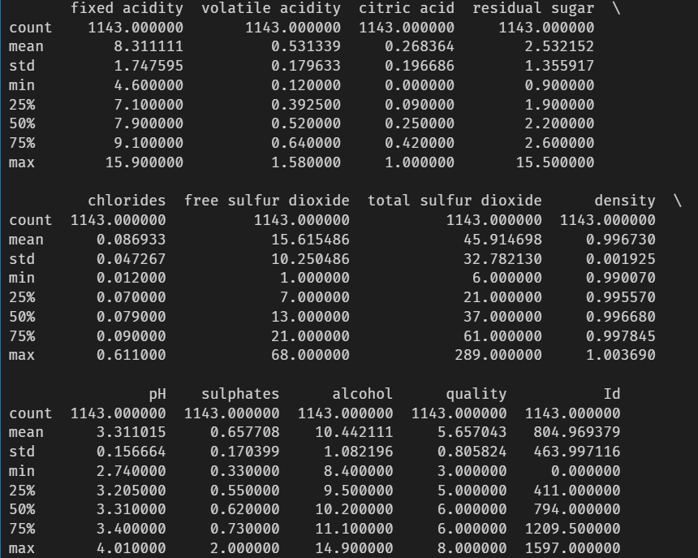

Graph that shows the distribution of the various labels across the
entire dataset

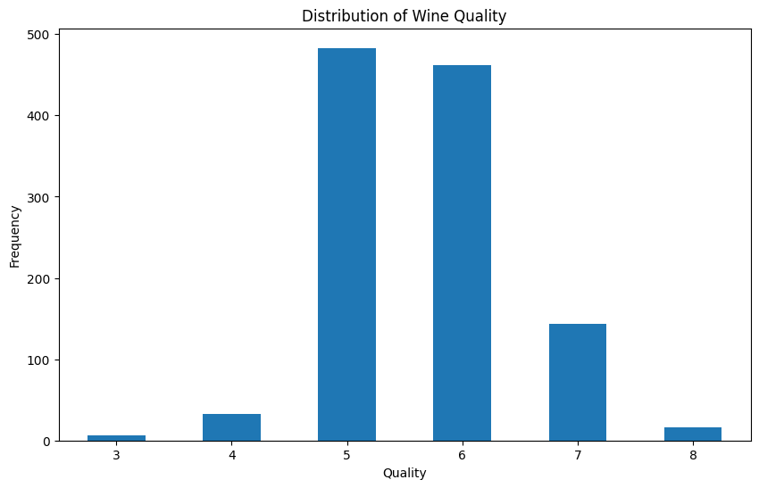

Standardised X:

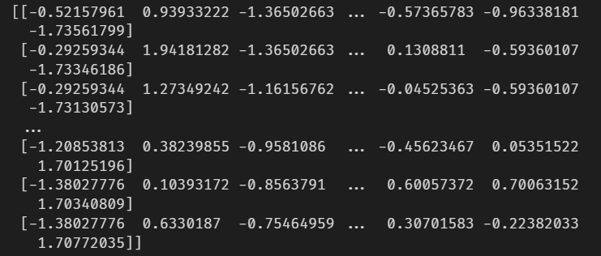

#### 2.2 MLP Classifier Class

Input :

mlp=MLPCLassification(hidden_layers=[9], learning_rate=0.01, activation='sigmoid',optimizer='sgd',batch_size=32, epochs=1000)

Output :

Early stopping at epoch 430
Accuracy: 64.04%
Average relative error: 2.1392853163194603e-08
Gradient check passed: True

Gradient Check verified.

#### 2.3 Hyperparameter tuning

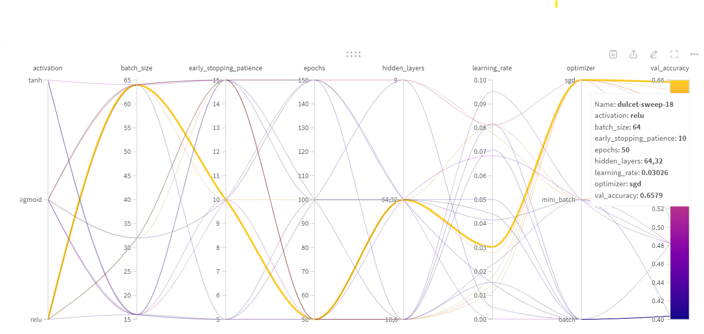

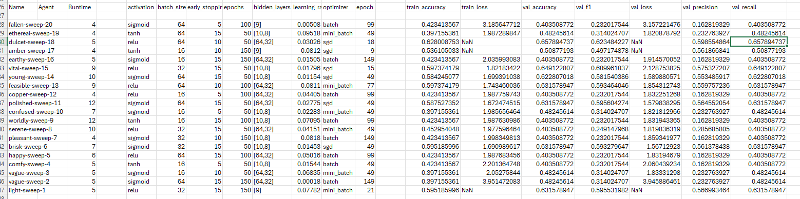

Best Model is displayed through both the images.

#### 2.4 Evaluating Single-label Classification Model 

Output :

Early stopping at epoch 14

Accuracy: 63.16%

#### 2.5 Analyzing Hyperparameters Effects

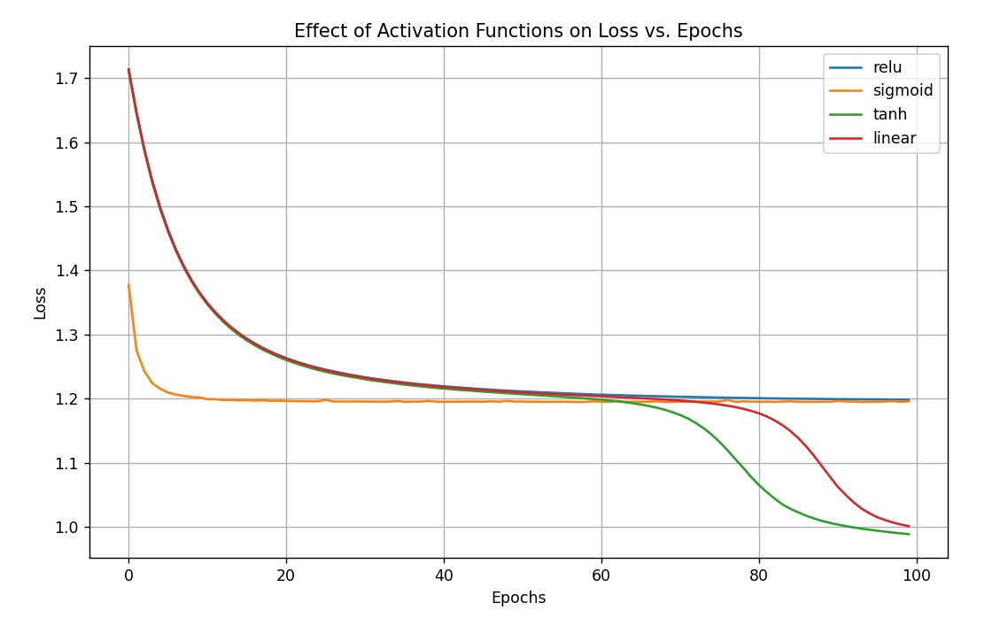

I could see that for the best model, that I get, sigmoid and relu converge at a nearly same loss, while linear and tanh have lesser loss but for more epochs.

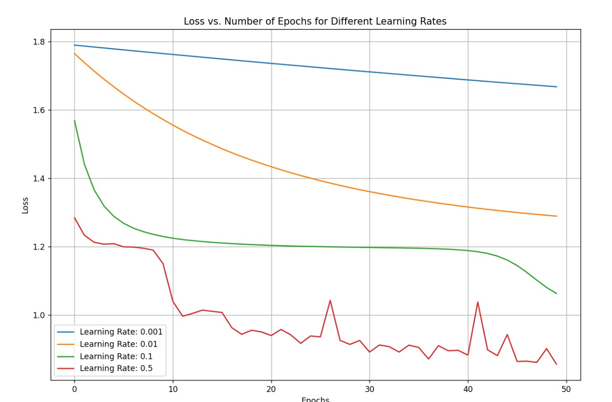

The loss is inversely proportional to the learning rate, we can see lesser loss, but for getting a good classification, smoother decrease is preferred, while for 0.5, I have very much increase and decrease, which isn't preferred.

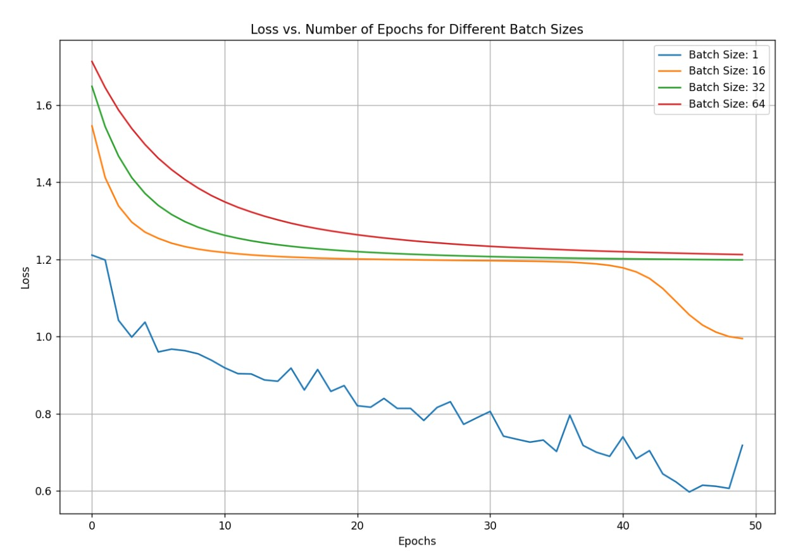

The loss decreses with the batch size, but similar to learning rate, a uniform decrease isnt seen in batcc size 1.

#### 2.6 Multi-Label Classification

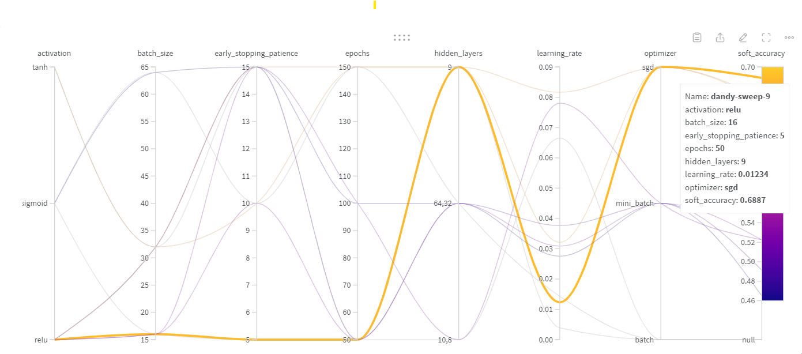

model = AdvancedMultiLabelMLP(
        input_size=input_size,
        hidden_sizes=[9],
        output_size=output_size,
        learning_rate=0.01234,
        activation='relu',  
        optimizer='sgd',    
        batch_size=16,
        epochs=50,
        early_stopping_pat=5
    )

Output :
    
Epoch 10/50, Loss: 0.6333
Epoch 20/50, Loss: 0.6284
Epoch 30/50, Loss: 0.6252
Epoch 40/50, Loss: 0.6221

Early stopping at epoch 42

 Accuracy: 0.0500
Precision: 0.5085
Recall: 0.1167
F1-score: 0.1899
Hamming Loss: 0.3200

Soft Accuracy: 0.6800

#### 2.7 Analysis

For the given model and dataset, as per the distribution graph, wine quality 5, 6, and 7 were very common. The classifier was also good at classifying for the corresponding inputs. So the accuracy for inputs with output 5,6,7 was very good. 

While in other cases, the model didn't perform much well, as they was no enough data to train the classifier (such as 3,4).

-------------------
### MLP Regression :

#### 3.1 Data Processing

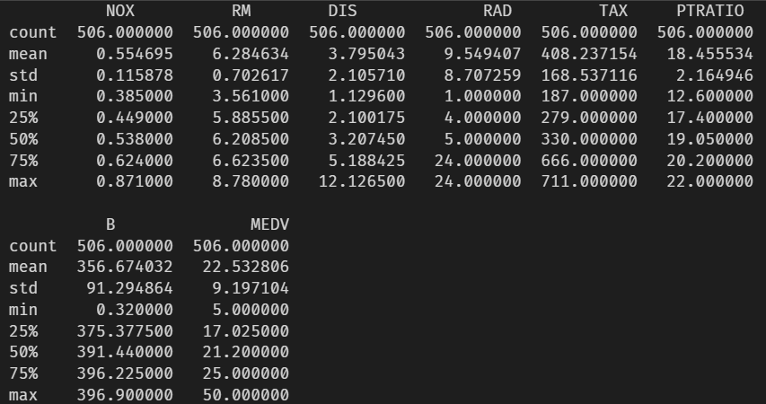

Graph that shows the distribution of the various labels across the
entire dataset

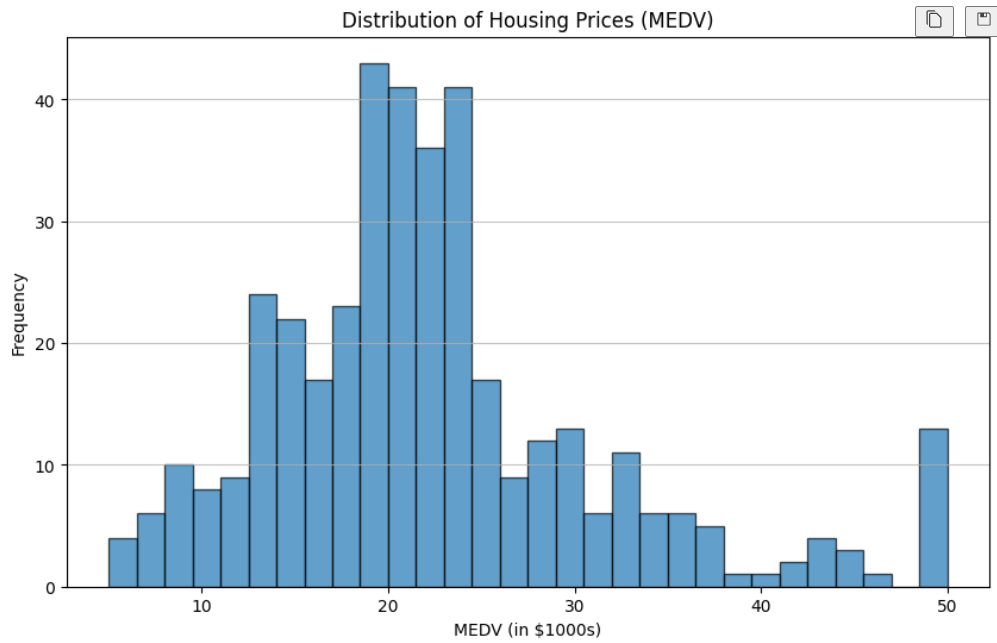

Standardised and Train test spilt X:

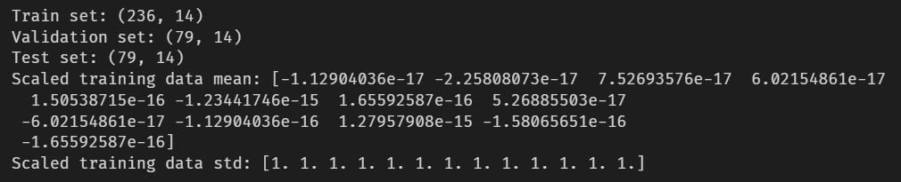

#### 3.2 MLPRegressionImplementation from Scratch

Input :

layers = [X_train.shape[1], 64, 32, 1]  # Input layer, two hidden layers, output layer

mlp = MLPRegression(layers=layers, learning_rate=0.01, activation='relu', optimizer='sgd', batch_size=32, epochs=100)

Output :

Validation MSE: 22.8572, RMSE: 4.7809, R²: 0.7092

#### 3.3 Model Training & Hyperparameter Tuning using W&B

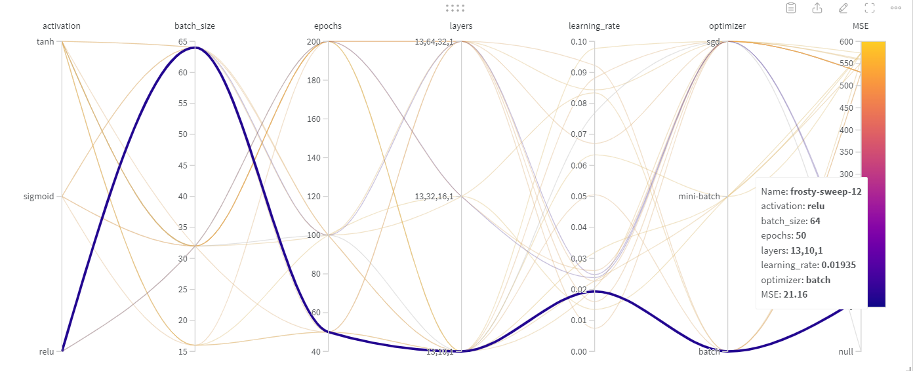

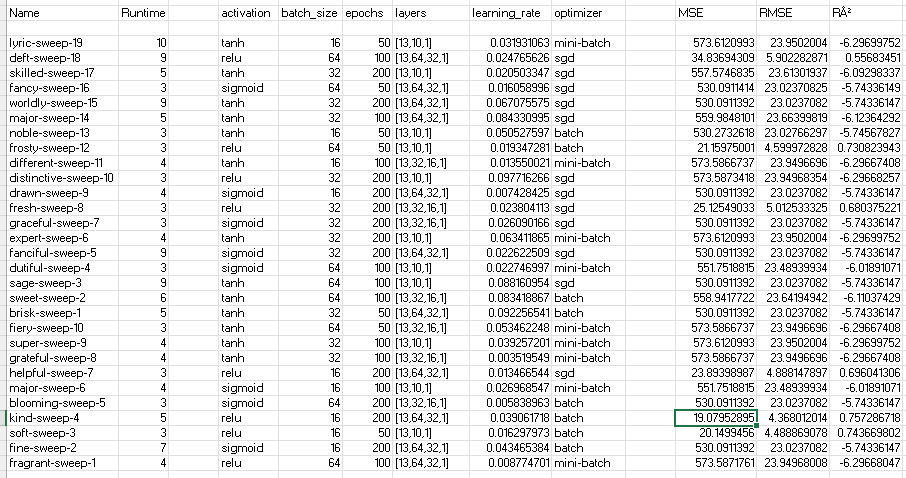

Best Model is displayed through both the images.

#### 3.4 Evaluating Model 

Upon testing it on testing part:

Output:
Validation MSE: 5.2147, RMSE: 2.2836, R²: -7.0248, MAE: 2.1366

#### 3.5 Mean Squared Error vs Binary Cross Entropy

Output :

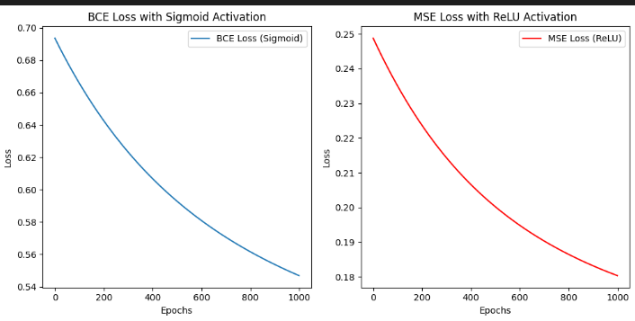

I can observe that the loss for BCE is higher in magnitude for lesser epochs. But it also converges quickly. (couldnt be seen through my plots expilcitely).
The loss of MSE has lower magnitude, but convergence should be comparatively at higher epochs.

#### 3.6 Analysis

Upon observing the MSE loss,

Features : If the data points regarding a certain featu are trained enough, they show lower mse, but if for the feature the model isnt trained much, it can give a larger mse.

Outliers: If an output is very different relatively from the other outputs, it can lead to larger mse. Comparatively, the other outputs have a lower mse.

Training Area : If the training data has dense outputs, it will lead to lower mse, while, in case of overspread data, it leads to higher mse.

Overfitting : Training tha data too much according to what is given leads to a learning dataset, not giving a best fit, and leading to overfitting and thus higher mse.

------------------

### AutoEncoder

####  4.1&2 AutoEncoder implementation from scratch, Train the autoencoder 

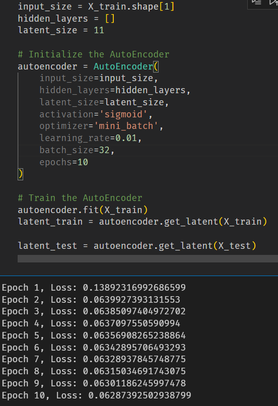

#### 4.3 Classification using KNN :

Output : (for whole dataset) 

F1 Score: 0.12728501927329697
Accuracy: 0.13666666666666666
Precision: 0.12858004746655868
Recall: 0.13543195595414487

Output : (for latent reduced dataset, k=21)

F1 Score: 0.12446778690259694
Accuracy: 0.13315789473684211
Precision: 0.1268466992027855
Recall: 0.13215106904265014

OBSERVATION :

For the reduced dataset using Autoencoder, obvoiusly, it has lower accuracy on KNN as compared to the initial dataset. 

But it is also worse than the PCA, due to no linearity being included in it.

#### 4.4 Classification using MLPClassification :

Output :

F1 Score: 0.1288447835539762
Accuracy: 0.13350877192982455
Precision: 0.1538443087106204
Recall: 0.13192322762786104

OBSERVATION :

For the reduced dataset using MLP AutoEncoder, the MLP classifier is comparatively good than the KNN.

MLP is more effective at capturing the inherent structure and non-linearities present in the data.

The linearity of KNN limits it in most of the cases.

