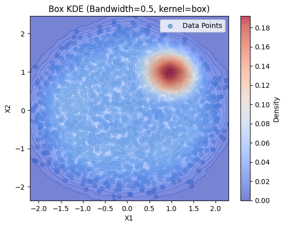

# Assignment 5 Report

## Kernel Density Estimation:

### Task 2 : Generate Synthetic Data

### Task 3 : KDE vs GMM

GMM implementation for different no. of componenets :

 

------------------------

When we use two components for the GMM model, what do you observe?

For k=2, we can say that the smaller circle dataset fully is fully captured through clustering, but the boundary points aren't captured correctly.  

What happens to the GMM model as the number of components increase?

As per my observation, the dataset starts to overfit through the model with increasing k. So, an optimal k would be mostly less than 5.

________________

KDE implemented over differen kernels and bandwidths :

|Kernel/Bandwidth | Bandwidth = 0.5 | Bandwidth = 0.75 |
|-----------------|----------------------------------|----------------------------------|
|Gaussian Kernel|  |  |
|Box Kernel|   |  |
|Triangular Kernel|   |  |

For the KDE plots, we could see that 

- With Bandwith : Less bandwidht shows KDE to follow the number of points in the dataset. While with higher bandwidth, we could see the smoothening or widening effect accordingly.

- With Kernel : Gaussian, box and triangular could be said to give bell, uniform, linear piecewise effect to the KDE. So the Gaussian kernel is typically preferred for its smooth properties, while the Box and Triangular kernels might be used for simpler, piecewise estimates

______________________________
_____________________________

## HMMs:

### 3.2 Dataset :

MFCC represented through the spectrogram (done for one sample ofeach digit) :

__________________

#### Can these patterns explain why HMM is a suitable method for this task?

__________________

The spoken digits is an example of data w.r.t. time. HMMs is the best model for handling sequential data. So for speech changing over time, HMMs could train the model correctly.

MFCC is a good representation of data changing with time. So this helps HMM to recognise the specific unique patterns for each digit, and get trained over the dataset.

Thus, the combination of MFCCs and HMMs is powerful because MFCCs capture the time-varying spectral content of speech, which is essential for recognizing speech sounds, while HMMs provide a framework for modeling the temporal structure and hidden states inherent in speech.

_________________________

###  3.4 Metrics :

Upon given Dataset : On Test Data, Accuracy = 92.67%.

Upon personal Recordings : Accuracy = 17.5%
(Reason being the recordings not being noisefree and also not tuned according to required frequency, or many other aspects.)

Thus, currently the model works better on the test data from the given dataset, as compared to the personal recordings.

